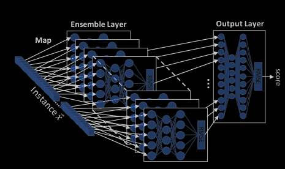

# Kitsune: An Ensemble of Autoencoders of Online Network Intrusion Detection

## Abstract

- ***Kitsune*** represents plug and play NIDS (network intrusion detection system) which learns to detect to detect attacks on the local network, without supervision, in an online manner.

- Kitsune's core algorithm (KitNET) uses an ensamble of neural networks called autoencoders to differentiate between normal traffic and attacks. 

- Evalutation shows that Kitsune can detect various attacks with a comparable to offline anomaly detectors.

## 1. Introduction

- Conventially a NIDS is deployed at single point, ie Internet gateway. This *point* deployment strategy can detect malicious traffic entering and leaving the network, but not malicious traffic traversing the network itself.
- To solve this problem distributed deployment strategy can be used, where number of NIDSs are connected to a set of strategic routers and gateways within the network.

- In the last decade ANNs were used to perform network traffic inspection.

- The lyfecycle of the ANN-based clasifier in a *point* deployment strategy looks like the following:
 
    1. Have an expert collect a dataset containing both normal trafic and network attacks
    2. Train the ANN to classify the difference between normal and attack traffic, using a strong CPU or GPU
    3. Transfer a copy of the trained model to the network/organization's NIDS
    4. Have the NIDS execute the trained model on the observed network traffic

ANN of this type is impractical because of the offline processing, Supervised learning, High complexity.

Because of these challenges its suggested that the development of an ANN-based network intrusion detector, which is to be deployed and trained on router in a distributed manner, should follow the following restrictions:

- Online Processing - one packet at a time is looked at. The data is extracted as it needed and rewires the internal mathematical 
- Unsupervised Learning - labels are not used, the system is only "plugged in" and it learns what "normal everyday behavior" looks like for that network. Once the normal baseline has been established, it flags everything that deviates heavily from that baseline as anomaly.
- Low Complexity - math behind Kitsune is stripped down to be incredibly lightweight. It ensures that the time it takes the AI to inspect a packet is faster than the time it takes for the next packet to arrive.

Kitsune in Japanese folklore is a mythical fox-like creature that has number of tails, can mimic different forms, and whose strength increases with experience.

Kitsune architecture has, similarly, an ensamble of small neural networks (autoencoders), which are trained to mimic (reconstruct) network traffic patterns, and whose performance incrementally improves overtime.

The architecture of KitNET:
